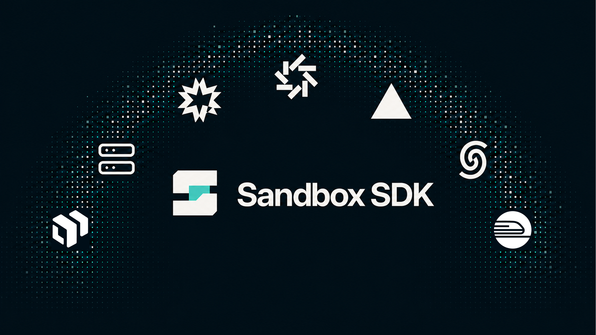

<p align="center">
  
</p>

Run one TypeScript sandbox API across Memory, Local, E2B, Daytona, Vercel Sandbox, Upstash Box, Ascii Box, Railway Sandboxes, and a Cloudflare Worker binding.

## Install

```bash
bun add @opencoredev/sandbox-sdk
```

Node.js 22 or 24 is supported. Bun 1.3 or newer is also supported.

## Quickstart

```ts
import { e2b } from "@opencoredev/sandbox-sdk/e2b";

await using sandbox = await e2b().create();
console.log((await sandbox.$`node --version`).stdout);
```

`createSandbox({ provider })` still works. For tests with no VM, use `memory()`.

`await using` stops the sandbox automatically when its scope exits, including when an operation throws.

Node.js 24 and Bun run this syntax directly. On Node.js 22, compile TypeScript to ES2022 or use the callback-style `withSandbox()` helper.

## Providers

| Provider                                                        | Runtime                 | Best for                                |
| --------------------------------------------------------------- | ----------------------- | --------------------------------------- |
| [Memory](https://sandbox-sdk.app/docs/providers/memory)         | In-process              | Unit tests. Not a security boundary     |
| [Local](https://sandbox-sdk.app/docs/providers/local)           | AgentOS VM              | Development, CI, and self-hosting       |
| [E2B](https://sandbox-sdk.app/docs/providers/e2b)               | Hosted Linux sandbox    | Coding agents and isolated jobs         |
| [Daytona](https://sandbox-sdk.app/docs/providers/daytona)       | Cloud workspace         | Persistent projects and GPUs            |
| [Vercel Sandbox](https://sandbox-sdk.app/docs/providers/vercel) | Hosted Linux sandbox    | Coding agents and persistent workspaces |
| [Upstash Box](https://sandbox-sdk.app/docs/providers/upstash)   | Durable cloud container | Serverless agents and long-lived state  |
| [Ascii Box](https://sandbox-sdk.app/docs/providers/box)         | Persistent cloud VM     | Full VMs and protected app previews     |
| [Railway](https://sandbox-sdk.app/docs/providers/railway)       | Ephemeral cloud VM      | Durable jobs and private networking     |
| [Cloudflare](https://sandbox-sdk.app/docs/providers/cloudflare) | Worker container        | Worker-bound sandboxes                  |

Local is included. Cloud providers use their official SDKs and credentials.

## Documentation

Setup, usage, integrations, and API reference are available at [sandbox-sdk.app/docs](https://sandbox-sdk.app/docs).

Focused runnable examples live in [`packages/sdk/examples`](./packages/sdk/examples).
Maintainer release instructions are in [RELEASING.md](./RELEASING.md).

## License

[MIT](./LICENSE) © OpenCore
